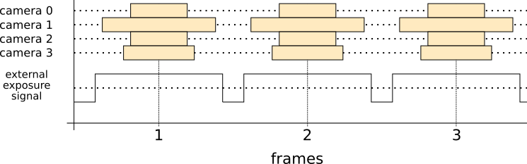

# Alphasense Core GPIO Functions

The Alphasense Core has a GPIO connector that can be used for several different functions. On a standard Alphasense Core all extra functions are disabled, contact support@sevensense.ch for function activation keys.

**Currently supported functions**
* [External Exposure Signal](#external-exposure-signal): GPIO1 Will go high when the camera with the longest exposure time starts its exposure, and will go low again when that camera finishes its exposure. In other words, the pulse on the GPIO1 pin will cover the exposure of all cameras.

The voltage for all GPIO pins is 3.3V for a logic 1 and 0V for a logic 0.

## The Connector

Two versions of the connector exists. The older Alphasense Core models have an 8 pin connector, the newer ones have a 10 pin connector. At the moment they both support the same extensions.

### 10 pin (new version)

Connector part no: [SM10B-GHS-TB from JST](http://www.jst-mfg.com/product/pdf/eng/eGH.pdf)  
Plug part no: [GHR-10V-S from JST](http://www.jst-mfg.com/product/pdf/eng/eGH.pdf)

**Pin numbering is according to the manufacturer's datasheet.**

Pin Number | Name
--- | --- 
1 | GPIO7
2 | GPIO8
3 | GPIO1 (External Exposure Signal)
4 | GPIO2
5 | 3.3V
6 | GPIO3_CS
7 | GPIO4_DIN
8 | GND
9 | GPIO5_DOUT
10 | GPIO6_SCLK

### 8 pins (old version)
Connector part no: [SM08B-GHS-TB from JST](http://www.jst-mfg.com/product/pdf/eng/eGH.pdf)  
Plug part no: [GHR-08V-S from JST](http://www.jst-mfg.com/product/pdf/eng/eGH.pdf)

**Pin numbering is according to the manufacturer's datasheet.**

Pin Number | Name
--- | --- 
1 | GPIO1 (External Exposure Signal)
2 | GPIO2
3 | 3.3V
4 | GPIO3_CS
5 | GPIO4_DIN
6 | GND
7 | GPIO5_DOUT
8 | GPIO6_SCLK

# External Exposure Signal

This function can be used to control for example an LED in sync with the exposure interval of the cameras.

GPIO1 will go high 10us before the first camera shutter opens, and goes low 10us after all camera shutters are closed. This is illustrated in the diagram below.

